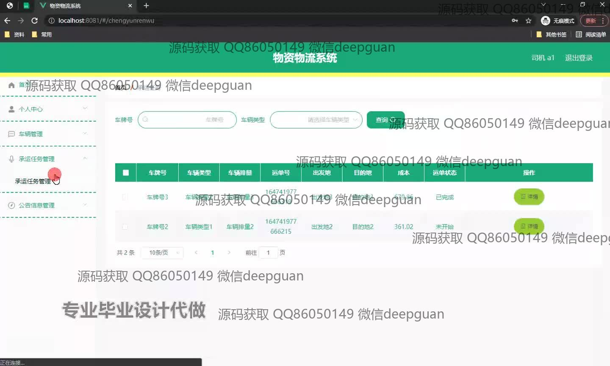
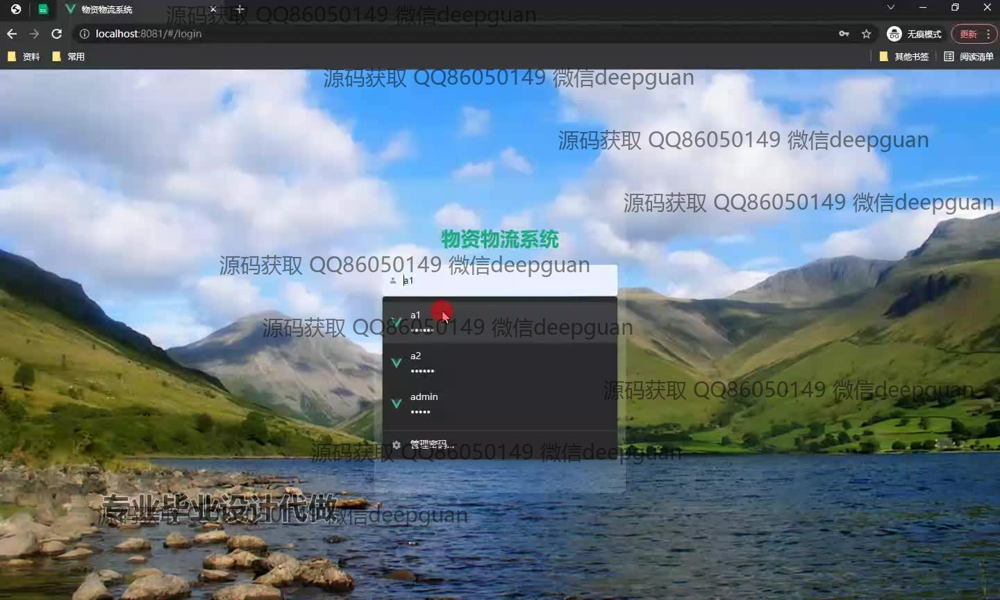
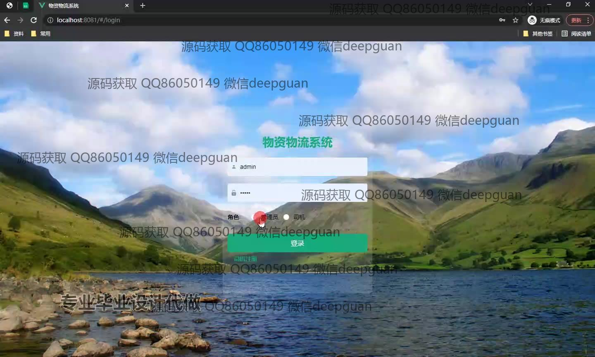
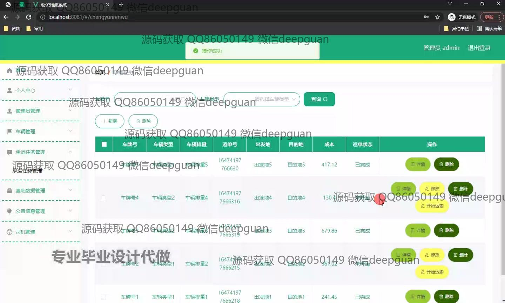
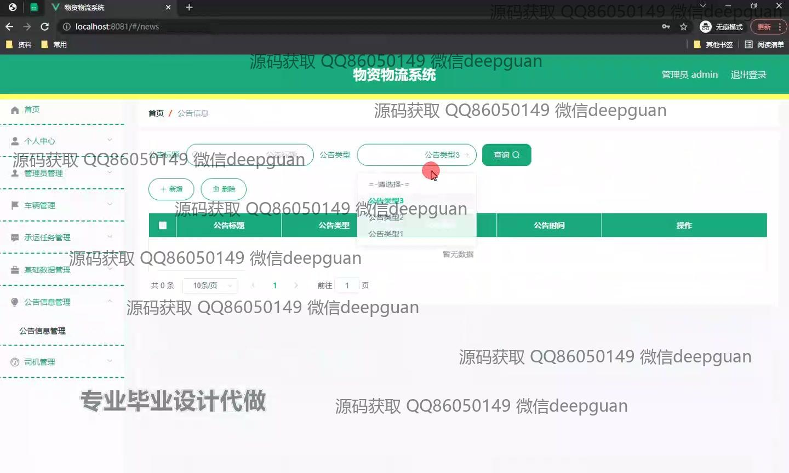
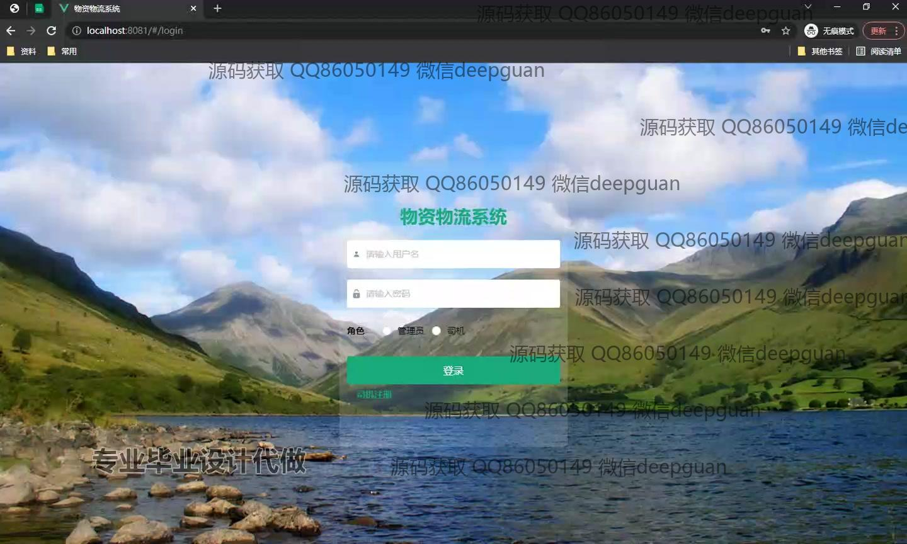

<h1 align="center">基于HTML和JS物资物流系统的设计与实现+vue</h1>

## 简介
物资物流系统：角色分为管理员、司机；功能包括车辆管理、承运任务管理、公司信息管理、登录验证、公告管理。    --计算机毕业设计源码；毕设源码；java毕业设计源码

## 联系方式

<h3 align="center">获取完整代码与数据库文件 + 微信：deepguan QQ: 86050149 QQ群: 783742310</h3>

<h3 align="center">可帮忙远程部署 包运行成功！提供远程部署、修改代码、设计文档指导、代码讲解等服务！</h3>

## 功能介绍（完整见运行截图）
管理员：提供登录、注册和退出功能，界面包括个人信息管理、车辆管理、公告信息管理以及承运任务管理等模块。管理员可通过界面进行用户和车辆的数据管理，支持公告的创建和删除，确保物流任务管理的高效性和准确性。

用户：用户能通过登录界面选择不同角色登录系统，提供个人中心访问、用户信息管理和查看公告功能。用户可以查看或修改自己的信息，并选择角色后，管理个人的物流任务，与系统进行交互。

司机：司机通过选择角色进入系统，可以查看和管理自己的运输任务，支持任务的评估和操作查询功能。司机账户可通过注册新用户功能创建，便于个人任务监控和管理，提升物流效率。

游客：游客可以在登录界面直观体验自然风景展示，同时注册为新用户或获取系统的基本概况，无需直接操作物流管理任务。

## 运行截图

本代码来源于网络,仅供学习参考使用!

